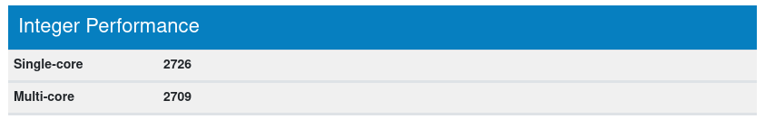
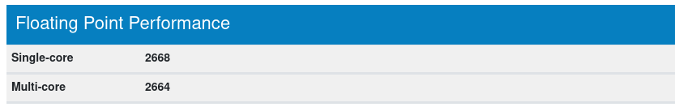
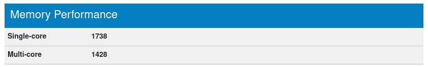
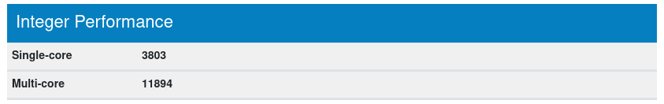
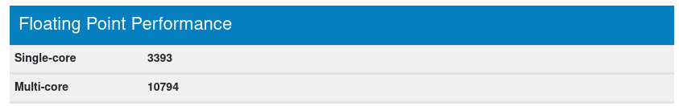
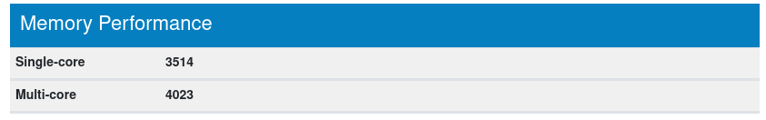

## TASK 2

Instance IP: ec2-3-88-12-254.compute-1.amazonaws.com

### Comment l'instance est créée et combien de temps met elle à se lancer

L'instance met environ 3s à se lancer.

### Deliverables

#### What is the smallest and the biggest instance type (in terms of virtual CPUs and memory) that you can choose from when creating an instance?

z1d.metal is the largest and t2.nano the smallest

#### How long did it take for the new instance to get into the running state?

Around 3 seconds

#### From the EC2 Management Console copy the public DNS name of the instance into the report.

ec2-54-91-180-147.compute-1.amazonaws.com

#### Using the commands to explore the machine listed earlier, respond to the following questions and explain how you came to the answer:

##### What's the difference between time here in Switzerland and the time set on the machine?

Tue Feb 20 14:53:05 UTC 2024 in the instance and Tue Feb 20 03:53:05 PM CET 2024 on my machine. The only difference is the time zone.

##### What's the name of the hypervisor?

With the command `lscpu` we can see it's Xen.

##### How much free space does the disk have?

With `df -h` we can see we have 6G available in the root partition

#### Try to ping the instance from your local machine. What do you see? Explain. Change the configuration to make it work. Ping the instance, record 5 round-trip times.

We cannot ping the instance because we only allowed SSH connection (port 22) into it.

We must change the security group we created. We add a new inbound rule to allow ICMP Echo request from any IPv4 (That's what we send to our instance when we ping it).

Once the rule added we can ping our instance:

```shell
$ ping ec2-3-88-12-254.compute-1.amazonaws.com

PING ec2-3-88-12-254.compute-1.amazonaws.com (3.88.12.254) 56(84) bytes of data.
64 bytes from ec2-3-88-12-254.compute-1.amazonaws.com (3.88.12.254): icmp_seq=1 ttl=41 time=95.1 ms
64 bytes from ec2-3-88-12-254.compute-1.amazonaws.com (3.88.12.254): icmp_seq=2 ttl=41 time=97.4 ms
64 bytes from ec2-3-88-12-254.compute-1.amazonaws.com (3.88.12.254): icmp_seq=3 ttl=41 time=95.3 ms
64 bytes from ec2-3-88-12-254.compute-1.amazonaws.com (3.88.12.254): icmp_seq=4 ttl=41 time=96.0 ms
64 bytes from ec2-3-88-12-254.compute-1.amazonaws.com (3.88.12.254): icmp_seq=5 ttl=41 time=95.8 ms
^C
--- ec2-3-88-12-254.compute-1.amazonaws.com ping statistics ---
5 packets transmitted, 5 received, 0% packet loss, time 4005ms
rtt min/avg/max/mdev = 95.131/95.924/97.424/0.810 ms
```
#### Determine the IP address seen by the operating system in the EC2 instance by running the ifconfig command. What type of address is it? Compare it to the address displayed by the ping command earlier. How do you explain that you can successfully communicate with the machine?

Running `ifconfig` gives us:

```shell
$ ifconfig

eth0: flags=4163<UP,BROADCAST,RUNNING,MULTICAST>  mtu 9001
        inet 172.31.22.29  netmask 255.255.240.0  broadcast 172.31.31.255
        inet6 fe80::80f:f3ff:fe8f:5405  prefixlen 64  scopeid 0x20<link>
        ether 0a:0f:f3:8f:54:05  txqueuelen 1000  (Ethernet)
        RX packets 90935  bytes 132205303 (132.2 MB)
        RX errors 0  dropped 0  overruns 0  frame 0
        TX packets 3624  bytes 347374 (347.3 KB)
        TX errors 0  dropped 0 overruns 0  carrier 0  collisions 0

lo: flags=73<UP,LOOPBACK,RUNNING>  mtu 65536
        inet 127.0.0.1  netmask 255.0.0.0
        inet6 ::1  prefixlen 128  scopeid 0x10<host>
        loop  txqueuelen 1000  (Local Loopback)
        RX packets 114  bytes 13270 (13.2 KB)
        RX errors 0  dropped 0  overruns 0  frame 0
        TX packets 114  bytes 13270 (13.2 KB)
        TX errors 0  dropped 0 overruns 0  carrier 0  collisions 0
```
We see here that the IPv4 of the eth0 is the private IP so not the one we used to ping it.

We use the public DNS IPv4 to ping our instance because we are not part of the private network of amazon.

### Wordpress

Mon IP élastique: 44.219.141.231

Affiche:


Un adresse IP élastique permet de faire plusieurs choses:
- Accéder à l'instance depuis internet si celle-ci n'a pas d'IPv4 publique
- De remapper rapidement cette adresse sur une autre instance si celle qui est associé a un problème

### GeekBench

La première fois que l'on lance geekbench dans notre instance, ça nous affiche:

```shell
Geekbench 3.3.0 Tryout : http://www.primatelabs.com/geekbench/

Geekbench 3 is in tryout mode.

Geekbench 3 requires an active Internet connection when in tryout mode, and 
automatically uploads test results to the Geekbench Browser. Other features, 
such as 64-bit tests, are unavailable in tryout mode.

Buy a Geekbench 3 license to enable offline use and remove the limitations of 
tryout mode.

If you would like to purchase Geekbench you can do so online:

  https://store.primatelabs.com/

If you have already purchased Geekbench, enter your email address and license 
key from your email receipt with the following command line:

  ./geekbench -r <email address> <license key>

  Running Gathering system information
System Information
  Operating System      Ubuntu 22.04.3 LTS 6.2.0-1017-aws x86_64
  Model                 Xen HVM domU
  Motherboard           N/A
  Processor             Intel(R) Xeon(R) CPU E5-2686 v4 @ 2.30GHz @ 2.30 GHz
                        1 Processor
  Processor ID          GenuineIntel Family 6 Model 79 Stepping 1
  L1 Instruction Cache  32.0 KB
  L1 Data Cache         32.0 KB
  L2 Cache              256 KB
  L3 Cache              45.0 MB
  Memory                950 MB 
  BIOS                  Xen 4.11.amazon
  Compiler              Clang 3.3 (tags/RELEASE_33/final)

Integer
  Running AES
  Running Twofish
  Running SHA1
  Running SHA2
  Running BZip2 Compress
  Running BZip2 Decompress
  Running JPEG Compress
  Running JPEG Decompress
  Running PNG Compress
  Running PNG Decompress
  Running Sobel
  Running Lua
  Running Dijkstra

Floating Point
  Running BlackScholes
  Running Mandelbrot
  Running Sharpen Filter
  Running Blur Filter
  Running SGEMM
  Running DGEMM
  Running SFFT
  Running DFFT
  Running N-Body
  Running Ray Trace

Memory
  Running Stream Copy
  Running Stream Scale
```

Et ensuite l'instance arrêtait geekbench sans donner les résultats. Cela pourrait venir du fait que mysql utilisait env. 40% de la RAM car une fois mysql arrêté le test continuait sans problème. Toutefois après avoir retesté un autre jour geekbench pu finir sans problème alors que mysql tournait en fond.

Le test fini cela nous affiche:

```shell
Geekbench 3.3.0 Tryout : http://www.primatelabs.com/geekbench/

Geekbench 3 is in tryout mode.

Geekbench 3 requires an active Internet connection when in tryout mode, and 
automatically uploads test results to the Geekbench Browser. Other features, 
such as 64-bit tests, are unavailable in tryout mode.

Buy a Geekbench 3 license to enable offline use and remove the limitations of 
tryout mode.

If you would like to purchase Geekbench you can do so online:

  https://store.primatelabs.com/

If you have already purchased Geekbench, enter your email address and license 
key from your email receipt with the following command line:

  ./geekbench -r <email address> <license key>

  Running Gathering system information
System Information
  Operating System      Ubuntu 22.04.3 LTS 6.2.0-1017-aws x86_64
  Model                 Xen HVM domU
  Motherboard           N/A
  Processor             Intel(R) Xeon(R) CPU E5-2686 v4 @ 2.30GHz @ 2.30 GHz
                        1 Processor
  Processor ID          GenuineIntel Family 6 Model 79 Stepping 1
  L1 Instruction Cache  32.0 KB
  L1 Data Cache         32.0 KB
  L2 Cache              256 KB
  L3 Cache              45.0 MB
  Memory                950 MB 
  BIOS                  Xen 4.11.amazon
  Compiler              Clang 3.3 (tags/RELEASE_33/final)

Integer
  Running AES
  Running Twofish
  Running SHA1
  Running SHA2
  Running BZip2 Compress
  Running BZip2 Decompress
  Running JPEG Compress
  Running JPEG Decompress
  Running PNG Compress
  Running PNG Decompress
  Running Sobel
  Running Lua
  Running Dijkstra

Floating Point
  Running BlackScholes
  Running Mandelbrot
  Running Sharpen Filter
  Running Blur Filter
  Running SGEMM
  Running DGEMM
  Running SFFT
  Running DFFT
  Running N-Body
  Running Ray Trace

Memory
  Running Stream Copy
  Running Stream Scale
  Running Stream Add
  Running Stream Triad


Uploading results to the Geekbench Browser. This could take a minute or two 
depending on the speed of your internet connection.

Upload succeeded. Visit the following link and view your results online:

  http://browser.primatelabs.com/geekbench3/9072455

Visit the following link and add this result to your profile:

  http://browser.primatelabs.com/geekbench3/claim/9072455?key=154957
```
On peut donc aller voir les [résultats](http://browser.primatelabs.com/geekbench3/9072455) :





Et également lancer geekbench sur notre machine:

```shell
Geekbench 3.3.0 Tryout : http://www.primatelabs.com/geekbench/

Geekbench 3 is in tryout mode.

Geekbench 3 requires an active Internet connection when in tryout mode, and 
automatically uploads test results to the Geekbench Browser. Other features, 
such as 64-bit tests, are unavailable in tryout mode.

Buy a Geekbench 3 license to enable offline use and remove the limitations of 
tryout mode.

If you would like to purchase Geekbench you can do so online:

  https://store.primatelabs.com/

If you have already purchased Geekbench, enter your email address and license 
key from your email receipt with the following command line:

  ./geekbench -r <email address> <license key>

  Running Gathering system information
System Information
  Operating System      Linux 6.7.5-100.fc38.x86_64 x86_64
  Model                 ASUSTeK COMPUTER INC. ZenBook UX333FN_UX333FN
  Motherboard           ASUSTeK COMPUTER INC. UX333FN
  Processor             Intel(R) Core(TM) i5-8265U CPU @ 1.60GHz @ 3.90 GHz
                        1 Processor, 4 Cores, 8 Threads
  Processor ID          GenuineIntel Family 6 Model 142 Stepping 11
  L1 Instruction Cache  32.0 KB x 4
  L1 Data Cache         32.0 KB x 4
  L2 Cache              256 KB x 4
  L3 Cache              6.00 MB
  Memory                7.57 GB 
  BIOS                  American Megatrends Inc. UX333FN.308
  Compiler              Clang 3.3 (tags/RELEASE_33/final)

Integer
  Running AES
  Running Twofish
  Running SHA1
  Running SHA2
  Running BZip2 Compress
  Running BZip2 Decompress
  Running JPEG Compress
  Running JPEG Decompress
  Running PNG Compress
  Running PNG Decompress
  Running Sobel
  Running Lua
  Running Dijkstra

Floating Point
  Running BlackScholes
  Running Mandelbrot
  Running Sharpen Filter
  Running Blur Filter
  Running SGEMM
  Running DGEMM
  Running SFFT
  Running DFFT
  Running N-Body
  Running Ray Trace

Memory
  Running Stream Copy
  Running Stream Scale
  Running Stream Add
  Running Stream Triad


Uploading results to the Geekbench Browser. This could take a minute or two 
depending on the speed of your internet connection.

Upload succeeded. Visit the following link and view your results online:

  http://browser.primatelabs.com/geekbench3/9072460

Visit the following link and add this result to your profile:

  http://browser.primatelabs.com/geekbench3/claim/9072460?key=949785
```
Et afficher les [résultats](http://browser.primatelabs.com/geekbench3/9072460) de notre machine:





Après comparaison on voit que l'instance et notre machine ont surtout une différence au niveau de la performance multi-core (une différence de env 7000 de score global et notamment au niveau du Integer ou il y a une différence de plus de 10'000). On peut que les performances au niveau de la mémoire sont relativement proche (comparé aux autres tests) avec seulement env. 3000 de différence pour le single et multi-core.

### Prix

#### How much does your instance cost per hour? How much does your disk cost per hour? What was the cost for this lab (make an approximate guess)? 

Instance price "On-demand" t2.micro: 0.0116 $/hours

Least expensive SSD -> General Purpose SSD (gp3): 0.08 $/GB-month

On a 8GB de SSD et ~730 heures par mois: 

$$ \frac{0.08 * 8}{730}\ = 0.000876712 \$/heures $$

Heures d'utilisation: ~1.5 hours/periods et 3 periods = 4.5 hours

Then :

$$ 4.5 * (0.0116 + 0.000876712) = 0.056145204 \$ $$ 

for this lab.

#### Calculate the total cost of the configuration used in the lab if everything was running continuously in production during a whole month. Take additionally into consideration the resources below. 

If we have 100000 visitors that download 85MB each, it amounts to 8500000 MB of downloaded data so 8.5 TB. And the 10 first TB by month cost 0.09 $/GB :

$$ 8500 * 0.09 = 765 \$ $$

Public IPv4 cost 0.005 $/hours. 

It gives us :

$$ 730 * (0.0116 + 0.005) + 8 * 0.08 + 765 = 777.758 \$ $$

for a month of usage.


